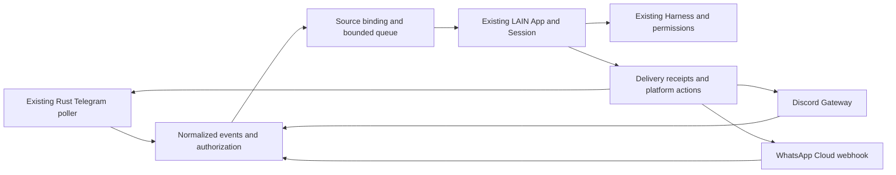

# LAIN Bot

LAIN Bot is a messaging surface for the existing App, Session, turn loop and
Harness. It does not have its own model loop, tool registry, memory, task engine
or permission policy. Telegram, Discord and WhatsApp share one gateway.



## Configuration and startup

Use the existing LAIN config file (`config.configFile()`, normally
`~/.lain-v2/config.json`, or the selected `LAIN_CONFIG_DIR`). Merge the `bot`
section into your existing configuration; preserve your model/provider settings.
IDs below are placeholders. Empty sender lists deny access, except previously
paired Telegram private chats. Do not use names, nicknames or wildcards.

```json
{
  "bot": {
    "maxConcurrent": 2,
    "platforms": {
      "telegram": {
        "enabled": true,
        "accountId": "personal",
        "tokenEnv": "LAIN_TELEGRAM_TOKEN",
        "allowUsers": ["YOUR_TELEGRAM_USER_ID"],
        "allowChats": [],
        "ambient": false
      },
      "discord": {
        "enabled": true,
        "accountId": "development",
        "tokenEnv": "LAIN_DISCORD_TOKEN",
        "allowUsers": ["YOUR_DISCORD_USER_ID"],
        "allowGuilds": ["YOUR_GUILD_ID"],
        "allowChannels": ["YOUR_CHANNEL_ID"],
        "ambient": false
      },
      "whatsapp": {
        "enabled": false,
        "accountId": "business",
        "phoneNumberId": "YOUR_META_PHONE_NUMBER_ID",
        "apiVersion": "YOUR_SUPPORTED_GRAPH_API_VERSION",
        "tokenEnv": "LAIN_WHATSAPP_TOKEN",
        "appSecretEnv": "LAIN_WHATSAPP_APP_SECRET",
        "verifyTokenEnv": "LAIN_WHATSAPP_VERIFY_TOKEN",
        "allowUsers": ["YOUR_WHATSAPP_SENDER_ID"],
        "port": 8787
      }
    }
  }
}
```

Supply secrets in those environment variables to the process that starts LAIN.
The config contains variable names, never token values. Telegram `tokenEnv` is
optional when the existing Rust supervisor already has a verified credential.
When it has none, gateway attachment verifies and stores the supplied token using
the existing Rust credential boundary before starting its one poller. Supplying
an environment variable does not replace a previously configured Telegram bot.
An optional `botId` pins Telegram/Discord to an expected numeric bot identity.

Actual platform identities are also bound to account profiles in transport state.
Changing the bot behind an existing profile is refused; select a new accountId
for a different bot. One account per platform per configuration is supported.

Run `lain --bot --cwd <workspace>` for a foreground service. Ctrl+C or SIGTERM
stops it. In an interactive CLI, `/bot start` starts a service owned by that CLI;
exiting the CLI stops it. `/bot`, `/bot platforms`, `/bot stop` and `/bot restart`
show/control the service. A local one-shot `/bot start` directs you to `--bot` so
it cannot accidentally leave a detached service behind. `/doctor` and `--doctor`
read the existing service status without starting it. `/rc` stays removed.

The OS owns a loopback socket lock derived from the canonical config path. A
second service using that configuration fails closed. The small local control
protocol accepts status/stop with a random capability stored under the existing
config home. Stale files never authorize killing a PID. A port collision is a
startup failure, not permission to stop another process.

### Platform setup

Telegram requires the supervisor built from this repository version. Gateway
support is loaded when that supervisor starts; rebuilding cannot upgrade a
daemon already in memory. A running older daemon is left alone and the adapter
reports unavailable with a restart explanation. Restart it only after its
existing work can stop. The workspace release binary includes this pass.
Gateway attachment does not replace or duplicate the Rust `getUpdates` loop. Once a home
has entered gateway mode, that mode survives crashes and shutdown: it cannot
silently fall back to the old remote brain or machine-wide session commands.
Previous private-chat pairing remains valid. Configure stable sender IDs for
additional users; the removed `/rc` pairing UI is not restored. The gateway does
not implement `/pair`. For groups, configure both users and group chat IDs, and
address the bot or reply to its message. Disable Telegram privacy mode only when
the intended group behavior requires it.

Discord requires Node 22+ for native WebSocket support, a bot token, appropriate
channel permissions, and Message Content intent enabled in the Developer Portal.
The adapter requests guild, guild-message, direct-message and message-content
intents. Guild access needs an allowed sender, guild and channel. Threads inherit
the configured parent channel permission and retain their own session identity.
Use a mention or reply unless ambient mode was explicitly configured. Sharding,
voice and slash-command registration are not implemented. The transport follows
Discord's documented heartbeat, identify and resume lifecycle.
[Discord Gateway](https://docs.discord.com/developers/events/gateway).

WhatsApp uses the official Meta Cloud API. It is not a WhatsApp Web session or an
unofficial phone connector. Configure a supported Graph API version (for example,
the version shown in your Meta app), phone-number ID and the three secrets above.
Expose `http://127.0.0.1:<port>/webhook` through your own HTTPS reverse proxy and
subscribe the app to messages. GET verification and POST HMAC checks are separate;
POST checks `X-Hub-Signature-256` over the original request bytes before parsing.
The phone-number ID must match the configured account. Free-form outbound messages
are limited to the customer-service response window; template campaigns are not
implemented. [Meta webhook guide](https://whatsapp.github.io/WhatsApp-Nodejs-SDK/receivingMessages/),
[Meta messages collection](https://www.postman.com/meta/whatsapp-business-platform/folder/o48mro7/messages).

## Identity, authorization and permissions

The session binding hashes a JSON tuple of platform, account profile, chat,
thread, and sender. Even two authorized people in one group get separate Session
files. Message IDs deduplicate delivery, not session identity. Full Session IDs
are restored only from the binding; there is no latest-session or cwd fallback.
All platforms keep separate histories. Project files intentionally remain the
configured workspace, just as they do for the CLI.

Authorization runs before Session construction, model requests, media download
and tool execution. Group/channel policy additionally requires addressed traffic
unless `ambient: true` is explicit. Bot/self/webhook echoes are ignored. An
authorized sender is not a machine-permission grant: directory trust still goes
through `gate`/`trustask`, and desktop access still goes through `permissions`.
Remote mutation calls also check their working directory when no file path was
named. The trusted local pipe shortcut does not apply to a messaging App.

Prompts have a random request ID, source binding, choices and expiry. Telegram
keyboards and Discord components carry only the request/choice IDs. The text
fallback is `/answer <request-id> <number-or-text>`. Replies from another sender,
thread or account, expired replies, invalid choices and repeated replies cannot
grant consent. Timeout, cancellation and failed prompt delivery resolve to no
answer. Remote directory approval permits one operation and never silently
persists a broader trusted directory. Desktop grants keep the existing narrow,
temporary scopes. [Telegram Bot API](https://core.telegram.org/bots/api),
[Discord interactions](https://docs.discord.com/developers/interactions/receiving-and-responding).

## Conversations and work

Ordinary messages call the existing App.submit. `/stop` (or `stop` in a DM) uses
its AbortController, cancels its background tasks/prompts and clears its queued
messages. `/steer <text>` uses the existing NOW steering path. `/bg <task>` calls
App.startBackground; `/bg` or `/jobs` reports only this App's jobs, and
`/cancel <number>` or `/bg stop <number>` cancels one, including during a lead turn.
`/ps` projects this App's existing owned process records. Completion notifications come from the job's actual
settlement promise and retain the initiating message's destination. They do not
start a second model turn or poll job state. Child transcripts are not broadcast.

Messaging intentionally exposes only these controls plus `/artifacts` and
`/send <artifact-id>`. It cannot select arbitrary CLI sessions or issue local
configuration commands. Internal callers use Delivery.sendMessage with an
explicit destination and idempotency key; no model is required for a notification.

One conversation has one writer. Other conversations share a bounded fair queue:
two active turns by default (configurable 1–8), eight queued messages per source,
128 queued messages total, and at most two background tasks per conversation.
Telegram retains a full mailbox on backpressure; WhatsApp requests retry with
HTTP 503; Discord sends a capacity response. A restart does not replay a turn that
may already have used tools. Such turns are reported as interrupted.

## Delivery and files

All final messages are buffered and split at the adapter boundary. Discord code
fences are closed/reopened; UTF-16 limits and surrogate pairs are respected.
Telegram and WhatsApp use plain text. Typing refreshes are transient and cease
on every exit. WhatsApp advertises no typing/edit/buttons capability.

The transport ledger records all text fragments before sending. States are
pending, sending, delivered, failed and uncertain. Here delivered means the
platform API acknowledged a message ID; it is not a claim that a handset read it.
Explicit 429 responses may retry up to three attempts with the stated delay.
Model/provider limits remain owned by the existing provider machinery. A timeout
or crash during send becomes uncertain and is never blindly repeated. Recovery
can send never-started text fragments only after a known predecessor ACK and
current configured authorization. Expired prompt and file operations are not
automatically replayed. Pending/uncertain receipts are retained for review.

Discord and WhatsApp can download images/documents/audio/video as untrusted file
artifacts. Downloads follow opaque platform references, validate exact platform
hosts, refuse redirects and cap bytes at the existing 2 MiB Harness artifact
limit. URLs and authentication headers stay inside adapters. No automatic OCR,
audio transcription or execution is claimed. A task must own the artifact before
staging. Expired Discord download references after restart are reported unavailable.

`/artifacts` lists artifacts from this conversation's latest in-memory Harness
task. `/send <artifact-id>` checks that ownership and the existing artifact index,
then uploads actual file bytes through Discord or WhatsApp. It never accepts an
arbitrary host path. It does not export another session's artifacts. Telegram
currently normalizes attachment descriptions but advertises no media download or
upload support. File retrieval from previous process lifetimes is not exposed by
this messaging command; the existing local Harness artifact store retains them.

## Extension contract and limits

`src/bot/contract.js` exports version 1 events, descriptor validation, action
validation and Registry. A factory registers a capability descriptor and supplies
start(receive), stop(), and action(action); media download is optional. There is
no platform switch in Gateway or Runtime. Registering another adapter changes
adapter registration, not the App/turn/Harness engines. New action capabilities
must be declared explicitly; unsupported operations fail before transport.

The descriptor is also the initial generic connector contract: version, platform,
message limit, formatting, edit, typing, threads, buttons and media flags. No
external connector process or relay listener is shipped in this pass. A future
connector must use Harness ProcessManager ownership, authenticated bounded events
and actions, and this same admission path; descriptor claims alone cannot grant
sender or machine authority. This is deliberately not a new plugin framework.

Routing state is capped at 10,000 bindings, 128 live Apps, and 2,048 retained
inbound/delivery receipts per table. Receipt deduplication is bounded by retention;
it is not an eternal exactly-once guarantee. Outputs beyond 128,000 characters
carry an explicit shortening notice, with the full turn kept in the Session.
The service must remain running for callbacks and background notifications.

## Verification

Fixtures replace only external platform/model transports. Tests exercise the real
App, existing permission gate, Session persistence, Harness artifacts, Rust
Telegram poller/mailbox, native webhook server and lifecycle socket. Shared adapter
conformance covers all three adapters. No personal account, real messaging token
or paid model is needed by the test suite. Production account validation remains
an operator setup step; fixture success is not a live-platform certification.
